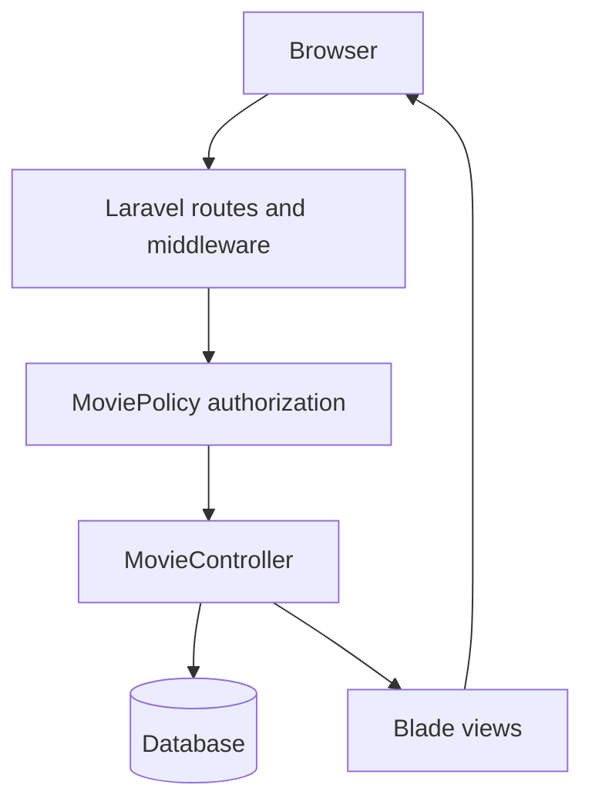

# Rotten Egg

A Laravel movie application exploring authentication, role-based permissions and ownership checks. Users can browse and search movies, producers can publish them, and authenticated users can leave comments.

This repository is being developed into a documented systems portfolio project. The current scope is a local application with authorization regression tests and a CI workflow. Cloud deployment, monitoring and disaster recovery are future work.

## What is implemented

- Movie browsing, title search, genre filtering and pagination.
- Movie creation, editing and deletion behind authentication and policy checks.
- Authenticated comments and notifications to movie owners.
- Registration, login, password reset and profile management, built on Laravel Breeze.
- Database migrations and factories, with SQLite for the documented local setup.
- A Laravel Sail configuration for an alternative Docker development environment.

## Application structure



PHP 8.2+ · Laravel 12 · Blade · Vite · Tailwind CSS

The test workflow uses PHP 8.3, Node.js 22 and in-memory SQLite. The existing Sail configuration includes MySQL and auxiliary development services; it is not a production deployment specification.

## Local setup

Prerequisites: Git, PHP 8.3 with SQLite/PDO, mbstring, XML/DOM and fileinfo extensions, Composer 2, and Node.js 22 with npm. This path does not require Docker or a paid cloud account.

```bash
git clone https://github.com/Elbu27/rotten_egg.git
cd rotten_egg
composer install
cp .env.example .env
php artisan key:generate
touch database/database.sqlite
php artisan migrate
php artisan storage:link
npm ci
npm run build
php artisan serve --host=127.0.0.1
```

Open <http://127.0.0.1:8000>. The example environment selects SQLite. Register a **Movie Producer** account to create movies, or a **User** account to browse and comment. The database starts empty; movies can be created without selecting genres. Administrator accounts cannot be created through public registration.

For frontend changes, run `npm run dev` in another terminal while the PHP server is running. Re-run `npm run build` when returning to built assets.

Keep `.env` local. The commands above start a development server; they are not instructions for exposing the application publicly.

## Permission model

| Action | Guest | User | Producer | Administrator |
| --- | --- | --- | --- | --- |
| Browse/search movies | Allowed | Allowed | Allowed | Allowed |
| Open creation form / create movie | Login required | Denied | Allowed | Allowed |
| Edit/delete own movie | Login required | Allowed by ownership policy* | Allowed | Allowed |
| Edit/delete another account's movie | Login required | Denied | Denied | Allowed |
| Comment | Login required | Allowed | Allowed | Allowed |

\* Ordinary users cannot create movies. The existing update/delete policy is ownership-based, so an owner retains these permissions if their role changes to `user`.

Public registration accepts `user` and `producer`, matching the existing interface. Omitted roles default to `user`; administrator and invalid role requests are rejected. A real deployment may require an approval process before granting producer access.

## Tests and CI

```bash
php artisan test
php artisan test --filter=MovieAuthorizationTest
php artisan test --filter=RegistrationRoleTest
```

Build the frontend and generate an application key before running the tests. `phpunit.xml` forces an in-memory SQLite database so the tests do not depend on a developer's database settings. Clear a previously cached application configuration with `php artisan config:clear` before testing.

The GitHub Actions [test workflow](.github/workflows/tests.yml) installs locked dependencies, builds assets and runs the full test suite on pushes and pull requests. Check the [Actions page](https://github.com/Elbu27/rotten_egg/actions/workflows/tests.yml) for the actual status.

The authorization tests cover allowed and denied HTTP requests, ownership spoofing during creation, and database state after rejected edits/deletes. Registration tests check both permitted roles and rejection of administrator, unknown and malformed role values.

Read the [authorization case study](docs/authorization-case-study.md) for the problem, decisions and validation evidence.

## Limitations and next steps

This is a learning application, not a production security assessment or a deployed cloud service.

- Complete application-specific tests beyond the authorization paths.
- Review movie metadata persistence, genre validation and unfinished comment editing/deletion.
- Verify email-verification requirements and complete the UI styling/accessibility review.
- Create a separate Linux deployment configuration with restricted database access.
- Add health checks, operational logs, a backup/restore drill and failure recovery notes.
- Choose a cloud provider and implement reproducible infrastructure with cost and teardown documentation.

Laravel/Breeze supply the application and authentication foundations. Project-specific logic lives in the movie, comment and notification code. See the commit and pull-request history for individual changes and their rationale.
